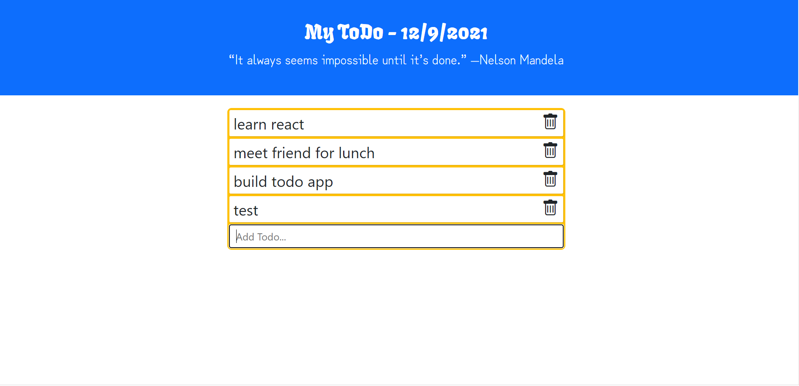

# TodoApp
# Name: TodoApp

## Description: 
Todo App is a project to demonstrate my React, JavaScript & html skills. Using this project you can track your to-do list everyday. I have used bootstrap icons and google fonts. 

## Installation: 
1. Download the project to your desktop. If zipped, unzip it. 
2. Run 'http-server -c-1' on the command promopt (If you do not have http setup, use npm i http-server to install it.)
2. Open index.html file in a browser by navigating to the location using the URL http://localhost:8080/ to track your todo list. 

## Usage: 
Use this project to play with React features..

## Support: 
There are many support portals available for JavaScript like MDN, StackOverflow, etc. You can use this forum to research various styles and ask questions.

## Roadmap: 
The future of this project is to strikethrough on removal and add a export mechanism to save the tasks each day. 

## License information: 

See MIT license release in repository.
